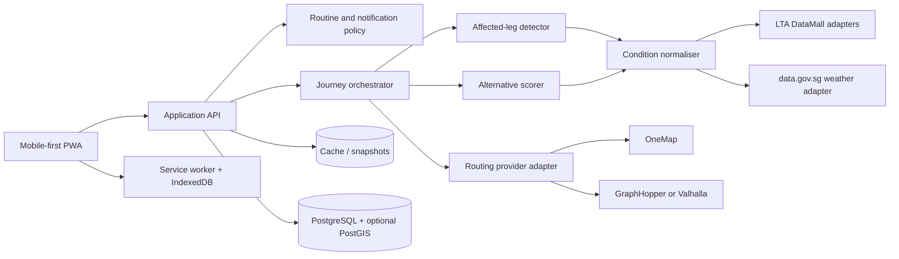

# Smart Commuter Companion

## Run the app

The first mobile-first vertical slice is now implemented with Next.js, TypeScript, MapLibre and deterministic journey fixtures.

```bash
npm install
npm run dev
```

Open `http://localhost:3000`. The app starts in a clearly labelled EWL disruption replay. Use **Show normal** in the header to see the quiet normal-day state.

```bash
npm test
npm run lint
npm run build
```

The current slice includes Today, Compare and Journey views, a real OSM-based map, fixture provider boundaries, affected-leg detection, a deterministic route recommendation, active-journey persistence and a production service worker. Live OneMap and DataMall credentials are not required yet; copy `.env.example` to `.env.local` when those adapters are added.

## Implementation tracker

### Demand-aware rerouting extension

A synthetic demand replay now adjusts crowding and arrival estimates using accepted demo routes. The surge case moves 400 simulated commuters towards the direct DTL alternative, then recommends a distinct Bus 31 + Thomson-East Coast Line corridor. Compare exposes the arithmetic and assumptions.

Optional participation is off until explicit opt-in. One latest demo route is stored per browser in server memory for a 30-minute session; retrying replaces the selection and withdrawal removes it. No GPS, SimplyGo account data or real travel histories are collected. This is a single-process demonstration, not a calibrated live passenger predictor.

See [implementation, hackathon compatibility and Codex handoff](docs/DEMAND_AWARE_ROUTING.md) for the demo script, accounting model, API contract, privacy details, tests and live deployment backlog.

The feature is on in development and off in production by default. To run the production-build demo, use `npm run build`, then `DEMAND_DEMO_ENABLED=true npm run start`. Keep it on a single Node process; serverless/multi-worker deployments do not share this in-memory store.

### Original delivery tracker

This checklist is the working delivery order. Update it as each slice is implemented and verified.

- [x] **Base application**
  - [x] Mobile-first Today, Compare and Journey screens.
  - [x] Normal-day and labelled disruption replay states.
  - [x] MapLibre/OSM route view with an offline schematic fallback.
  - [x] PWA manifest, service worker and active-journey persistence.
- [x] **1. Application API and journey orchestrator**
  - [x] Implement `POST /api/journeys/plan`.
  - [x] Implement `POST /api/journeys/:id/evaluate`.
  - [x] Implement `GET /api/journeys/:id/compare`.
  - [x] Move scenario evaluation and recommendation construction out of React components.
  - [x] Keep deterministic fixture providers as the default backend.
  - [x] Add application-layer tests and client-visible failure handling.
- [x] **2. Complete the affected-leg engine**
  - [x] Match event validity against each leg's expected travel window.
  - [x] Add canonical LTA line and station-code mappings.
  - [x] Split rail geometry so only the affected EWL portion is highlighted.
  - [x] Test station matches, unrelated events, adjacent segments and expired events.
- [x] **3. Replace hard-coded scores**
  - [x] Calculate deadline risk, delay, walking, transfers, crowding and route churn.
  - [x] Apply configurable Rachel-specific weights.
  - [x] Return a human-readable score breakdown to the Compare screen.
- [x] **4. Provider integrations** — implemented; live credential verification remains deployment work.
  - [x] Add authenticated OneMap geocoding and public-transport routing.
  - [x] Add a schema-validated DataMall `TrainServiceAlerts` adapter.
  - [x] Add separate forecast/real-time crowding and weather adapters.
  - [x] Store provenance, timestamps, validity and replay/live state consistently.
- [x] **5. Routine and morning-check flow** — implemented; database migration and real-device push verification remain deployment work.
  - [x] Add an editable IndexedDB-owned routine.
  - [x] Implement `Run live morning check`.
  - [x] Trigger advice only when deadline or disruption thresholds are crossed.
  - [x] Add PostgreSQL fingerprinting, cooldown records, Vercel scheduling and Web Push.
- [ ] **6. Proper offline persistence**
  - [ ] Move active-journey storage from `localStorage` to IndexedDB.
  - [ ] Cache relevant conditions and their timestamps.
  - [ ] Test offline opening, stale-data messaging and reconnection.
- [ ] **7. Submission-grade testing**
  - [ ] Add end-to-end normal, disruption, rain, offline and provider-failure tests.
  - [ ] Check accessibility and layout at 320, 360 and 390 px.
  - [ ] Test on iOS Safari and Android Chrome.

> A proactive, mobile-first journey companion for Rachel, a fixed-schedule commuter travelling from Tampines to Raffles Place. It notices when today is different, recommends one clear action before she leaves, and shows exactly how her route changes.

## 1. Project status

This document is the product and technical blueprint for the LTA Smart Mobility Hackathon Problem Statement 2. It is intentionally implementation-oriented so the team can begin with a thin end-to-end slice, then replace fixtures with live integrations.

### Working product promise

At about 07:30, before Rachel's usual 07:40 departure, the app checks her door-to-door journey against planned works, train disruptions, crowding and weather. If the expected impact is immaterial, it stays quiet. If the impact threatens her 08:45 arrival, it sends one actionable recommendation, for example:

> **Leave 10 minutes earlier and change at MacPherson. Expected arrival 08:41 (range 08:37-08:46). Avoids the affected EWL segment.**

The app is decision support, not another disruption dashboard.

## 2. Challenge interpretation

The specification requires a mobile-first web application for commuters that provides:

1. **Proactive advice** before a problem reaches the commuter.
2. **A recommended action**, not merely a network status.
3. **Planned and unplanned event handling**, including works and service disruptions.
4. **Personalisation** for a named persona.
5. **Door-to-door route planning** with realistic timing and visible uncertainty.
6. **A revised route when conditions change**.
7. **OpenStreetMap as the geospatial base**, with attribution and responsible tile/API use.
8. **Phone-readable visualisation** of the original route, affected section, alternative, crowding and time cost.
9. **Graceful behaviour without connectivity**, especially underground.

The app must run from a clean README, work in a real phone browser and support a reproducible end-to-end demo. Replayed or injected disruption data is allowed when clearly labelled; mocked data must never be presented as live.

## 3. Chosen persona: Rachel

| Attribute | Product implication |
|---|---|
| Tampines to Raffles Place via the East-West Line | Optimise the first complete demo around this corridor. |
| Leaves at 07:40 | Evaluate her trip shortly before departure, for example at 07:25-07:30. |
| Must reach her desk by 08:45 | Rank by probability of arriving on time, not just median duration. |
| Same commute for four years | Let her save or confirm a routine; do not make her search every day. |
| Does not check an app on normal days | Default to silence when no action is needed. |
| Five minutes is noise; fifteen minutes costs a meeting | Use a material-impact threshold and a deadline-risk trigger. |
| Wants one-line guidance | Put the recommendation and reason first; details remain expandable. |

### Jobs to be done

- Before leaving, tell me only if my normal commute is no longer safe.
- If it is affected, tell me what to do and when to leave.
- Show me why the alternative is better and what it costs.
- Keep the active instructions available when I lose signal underground.

### Non-goals for Rachel's MVP

- Serving every commuter persona equally well.
- Operating-centre dashboards or network-wide analytics.
- Social feeds, gamification or general travel discovery.
- A black-box prediction model without measurable value.

## 4. Problem framing

Most transport tools make commuters perform four tasks under pressure: notice an incident, decide whether it affects them, discover alternatives and judge the trade-off. Smart Commuter Companion moves that work into a pre-departure decision pipeline.

The primary outcome is:

> **Rachel arrives by 08:45 more reliably, with fewer unnecessary interruptions and less on-platform improvisation.**

Suggested MVP measures:

- **Actionability:** every alert contains a specific action, expected arrival range and reason.
- **Relevance:** no alert when the normal route remains within Rachel's tolerance.
- **Deadline protection:** percentage of replay scenarios where the selected route is predicted to arrive by 08:45.
- **Speed to comprehension:** a tester can state the recommended action within five seconds.
- **Reproducibility:** the same fixture and configuration produce the same recommendation.

Any numeric claim in the final submission should include its test set, baseline, calculation and limitations.

## 5. End-to-end demo scenario

The following timestamps and outcomes are illustrative demo data, not live claims. The injected event must be visibly labelled **Replay scenario**.

### Normal day

1. Rachel confirms a weekday routine: home in Tampines to her office in Raffles Place, depart 07:40, arrive by 08:45.
2. The app calculates and caches her usual door-to-door route, including both walking legs.
3. At 07:30, current and forecast conditions do not materially threaten the deadline.
4. The app stays quiet. Opening it shows: **Usual route is on track. Expected arrival 08:38-08:43.**

### Disrupted day

1. At 07:28, a labelled replay of `TrainServiceAlerts` reports an affected EWL segment that intersects Rachel's route.
2. The normal route is recalculated with event penalties and is now estimated to arrive after 08:45.
3. The engine requests feasible alternatives and compares them using time, uncertainty, transfers, walking/rain exposure, crowding and route churn.
4. At 07:30, Rachel sees one notification: **EWL disruption affects your trip. Leave by 07:35 and use the DTL alternative to arrive around 08:42.**
5. Opening the app shows:
   - the original route in muted styling;
   - the affected EWL portion in red/orange with an icon and text label;
   - the recommended alternative in a distinct solid style;
   - arrival ranges, extra walking, transfers and crowding for both;
   - a single **Use this route** action.
6. Rachel starts the route. The journey summary and next steps remain cached when connectivity drops underground.
7. When connectivity returns, the app refreshes conditions and clearly shows the data timestamp.

### Demo evidence to capture

- Fixture payload and its source/provenance.
- Baseline route and alternative route responses.
- Affected-leg match result.
- Candidate scores with a human-readable explanation.
- Screenshots or a recording from a real phone browser.
- Offline test showing the active journey still opens.

## 6. MVP scope

### Must have

- Mobile-first progressive web app.
- Saved Rachel routine with origin, destination, departure time and arrival deadline.
- Door-to-door route with walk and public-transport legs.
- OSM-based map with `© OpenStreetMap contributors` attribution.
- One routing-provider adapter connected to OneMap or a self-hosted engine.
- Live DataMall adapter for train alerts plus deterministic replay fixtures.
- Weather adapter for rain-sensitive walking penalties.
- Affected-leg detection against the current ordered journey.
- Alternative generation, scoring and explainable recommendation.
- Original-versus-alternative comparison.
- Three-level crowding display: low, moderate, high, with text/icon/shape as well as colour.
- Arrival-time range and last-updated timestamp.
- Offline cache for the active journey and latest known conditions.
- Clear setup, fixture and demo instructions.

### Should have

- `PCDForecast` for proactive platform crowding and `PCDRealTime` for current state.
- Bus arrival/load data when a bus alternative is proposed.
- Planned road works or planned bus route changes.
- Push notification support where browser permissions and deployment allow it.
- A visible **Why this changed** explanation.
- Telemetry for route latency, adapter failures and recommendation decisions, without precise-location logs.

### Could have after the core works

- Free-text notice parsing into structured event data, evaluated against a labelled sample.
- Disruption duration/escalation prediction with a calibrated confidence value.
- Calendar-aware routine exceptions, only with explicit permission.
- Accessibility presets or additional personas.
- Voice summary for hands-free use.

## 7. Proposed architecture

Start as a TypeScript modular monolith. It is faster to make reproducible during a hackathon and can later split into services without changing the domain boundaries.



### Main components

- **PWA:** route summary, comparison view, map, routine setup and offline active-journey view.
- **Application API:** validates requests, keeps credentials server-side and returns a frontend-friendly journey view model.
- **Routing adapter:** isolates OneMap, GraphHopper or Valhalla response formats behind one contract.
- **Condition normaliser:** maps train, crowding, bus, weather and planned-event feeds into a canonical event model.
- **Affected-leg detector:** identifies which legs of Rachel's already-planned journey intersect an event.
- **Alternative engine:** selects reroute boundaries, requests candidate routes and removes infeasible/duplicate results.
- **Scorer:** computes a transparent persona-specific score and an explanation.
- **Routine service:** decides when to evaluate and whether an impact merits interruption.
- **Snapshot/cache layer:** respects API limits, supports repeatable scoring and provides stale-but-useful offline state.
- **Fixture provider:** injects labelled scenarios through the same interfaces as live providers.

## 8. Data sources and APIs

| Source | MVP use | Important implementation notes |
|---|---|---|
| OpenStreetMap | Required geospatial base, paths and map context | Show attribution everywhere the map or derived data appears. Do not use public OSM tiles or Overpass for heavy/bulk traffic; use a compliant provider, cache, self-host or bundle a static extract. |
| OneMap | Geocoding and candidate door-to-door routing | Free registration is required. Keep it behind the routing adapter so the engine can be replaced. |
| GraphHopper or Valhalla | Self-hostable OSM routing for walking/cycling/road legs | Public transport requires suitable transit data/configuration; do not assume OSM alone provides a complete Singapore timetable. Prefer Valhalla if multimodal/transit support is configured; prefer GraphHopper for a simpler street-routing fallback. |
| DataMall `TrainServiceAlerts` | Official structured disruption and mitigation feed | `Status`, `AffectedSegments` and separate `Message` arrays must be handled. Feed is often quiet, so use labelled replay data for judging. |
| DataMall `PCDRealTime` | Current station crowd level | One line per request; refreshed about every 10 minutes; values are low/moderate/high/NA. |
| DataMall `PCDForecast` | Proactive crowd forecast | 30-minute intervals, published daily. Keep distinct from real-time density. |
| DataMall `v3/BusArrival` | Bus ETA, occupancy and vehicle details for bus alternatives | Load is per arriving bus (`SEA`, `SDA`, `LSD`), not a station crowd signal. Guide lists a 20-second update frequency. |
| DataMall network reference APIs | Bus services, routes and stops | Cache reference data. Most DataMall responses are capped at 500 records and use `$skip` pagination. |
| DataMall `TrafficIncidents`, `TrafficSpeedBands`, `RoadWorks`, `RoadOpenings` | Penalise disrupted bus/road legs and represent planned events | Normalise point/segment/time validity before matching to journey legs. |
| DataMall `PlannedBusRoutes` | Future bus route changes | Useful for the planned-event half of the brief. |
| DataMall `PV/Train`, `PV/ODTrain`, `PV/Bus`, `PV/ODBus` | Historical baseline and later routine/crowding features | Monthly batch data; not a live signal. |
| DataMall geospatial layers | `CoveredLinkWay`, `Footpath`, `CyclingPath`, `TrainStationExit`, `BusStopLocation` | Authoritative overlays can improve the OSM base. Cache and version them. |
| data.gov.sg weather | Rain and severe-weather penalties for walking | 24-hour and 4-day OpenAPI documents are supplied. Add 2-hour nowcast/rainfall for near-departure decisions. Optional API key provides higher limits. |
| Provided rail-station GeoJSON | Station footprint overlay or spatial matching reference | Contains 208 polygon features. `TYPE` is coarse, not a canonical line mapping. The file declares no CRS; coordinate values look like longitude/latitude, but validate against known stations before joining. |

### Data integration rules

1. Keep every external integration behind an interface with a live and fixture implementation.
2. Store source, fetched-at time, validity interval and raw snapshot ID on every normalised condition.
3. Build a canonical line-code table early. DataMall codes differ across endpoints, including LRT and line-extension cases.
4. Never combine the three crowding signals as if they were the same measurement.
5. Put secrets in environment variables or an ignored `.env.local`; commit only `.env.example`.
6. Follow source terms, licences, rate limits and attribution rules. Do not scrape when an official API exists.

## 9. Routing approach

### Use a routing engine; do not model Singapore as a DAG

Singapore's transport network contains loops, bidirectional travel, circular services and transfers. It is therefore not a directed acyclic graph. We will not build a whole-network DAG or implement our own shortest-path algorithm.

Instead:

1. Ask OneMap, GraphHopper or Valhalla for feasible route candidates.
2. Convert each response into a provider-neutral ordered list of journey legs.
3. Treat one planned journey as an ordered, acyclic path for analysis.
4. Detect the affected leg range.
5. Request alternatives around that range or recalculate the full route when necessary.
6. Score and explain the candidates for Rachel.

### Provider-neutral journey contract

```ts
type Mode = "walk" | "rail" | "bus" | "cycle";

interface Journey {
  id: string;
  origin: Place;
  destination: Place;
  departureAt: string;
  arrival: { p50: string; earliest: string; latest: string };
  legs: JourneyLeg[]; // ordered
  source: "onemap" | "graphhopper" | "valhalla" | "fixture";
  generatedAt: string;
}

interface JourneyLeg {
  id: string;
  sequence: number;
  mode: Mode;
  from: StopOrPlace;
  to: StopOrPlace;
  lineId?: string;       // canonical ID, e.g. EWL
  serviceNo?: string;
  stationCodes?: string[];
  geometry: GeoJSON.LineString;
  scheduledSeconds: number;
  waitSeconds?: number;
  uncertaintySeconds: number;
}
```

### Routing provider decision

- **Fastest MVP:** OneMap for geocoding and initial public-transport candidates, with OSM/MapLibre for the required map base.
- **More control:** self-host Valhalla or GraphHopper using an OSM Singapore extract for street legs. Confirm transit/timetable support before relying on it for rail and bus.
- **Recommended design:** implement `RoutingProvider` once, begin with OneMap plus fixtures, and keep Valhalla/GraphHopper as interchangeable adapters or fallbacks.

The team should run a one-day spike against the Rachel journey before locking the provider. Validate door-to-door coverage, transit modes, response licence/terms, geometry quality, latency and reproducibility.

## 10. Graph-based affected-leg detection

The detector operates on the ordered legs of the current journey, not on the whole transport network.

### Canonical event

```ts
interface TravelCondition {
  id: string;
  kind: "train_disruption" | "crowding" | "weather" | "road_incident" | "planned_work";
  severity: "info" | "minor" | "major";
  lineIds?: string[];
  stationCodes?: string[];
  stopCodes?: string[];
  area?: GeoJSON.Geometry;
  validFrom: string;
  validTo?: string;
  source: string;
  observedAt: string;
  isReplay: boolean;
}
```

### Matching algorithm

For each journey leg in sequence:

1. Match canonical line IDs.
2. Match station/stop codes and direction where available.
3. For road, weather or area events, test geometry intersection or a configured buffer.
4. Test whether the event validity overlaps the leg's expected traversal window.
5. Record affected leg indices and severity.

Merge adjacent affected indices into a segment. Select the last safe node before the segment as the reroute origin and one or more viable downstream nodes as re-entry candidates. Preserve unaffected prefix/suffix legs only if their timing and connection constraints remain valid.

If the disruption invalidates multiple separated portions, timing shifts make the suffix infeasible, or no safe re-entry point exists, request a complete origin-to-destination recalculation. Segment replacement is an optimisation, not a correctness requirement.

### Stitch validation

Before accepting a stitched journey, verify:

- spatial continuity between adjacent legs;
- chronological ordering and feasible transfer buffers;
- operating/service validity;
- no re-entry into an affected segment;
- complete origin-to-destination coverage;
- refreshed arrival range after the replacement.

## 11. Routine prediction and proactive trigger

Use a transparent rules-first approach for the MVP. Rachel's routine is stable, so a complex model is not necessary to demonstrate value.

### Routine setup

- Rachel explicitly saves origin, destination, usual departure time, weekdays and arrival deadline.
- Optional routine learning can later suggest a pattern only after repeated trips and must require confirmation.
- Record confidence and exceptions, such as work-from-home days, rather than silently assuming travel.

### Evaluation schedule

For a 07:40 routine:

- **Day before:** check planned works and known service changes.
- **Around 07:10:** refresh forecast crowding and weather.
- **Around 07:25-07:30:** fetch live conditions, recompute and decide whether to alert.
- **After journey starts:** refresh opportunistically, subject to connectivity and alert fatigue.

The scheduler can be simulated in the hackathon demo with a **Run morning check** control. Production browser push requires permission and a deployed service-worker/push backend; background execution is not guaranteed merely because the PWA is installed.

### Alert decision

Notify only when at least one condition is true:

- predicted arrival crosses Rachel's 08:45 deadline;
- expected delay reaches a configured material threshold, initially 10-15 minutes;
- a major event directly intersects the route;
- the recommended action must begin earlier than usual;
- a previously recommended route becomes invalid.

Suppress duplicate alerts using an event/routine/recommendation fingerprint and a cooldown. A material change may bypass the cooldown.

### Later prediction option

Once enough labelled history exists, estimate `P(arrive by deadline | route, departure, conditions)` using a calibrated model. Compare it with the deterministic baseline on held-out replay days. Do not ship the model unless it improves a commuter-facing measure and can explain its inputs and uncertainty.

## 12. Rerouting and scoring

### Candidate generation

Generate a small, diverse set:

- normal route under current penalties;
- full door-to-door reroute;
- affected-segment replacement with one or more safe re-entry nodes;
- earlier-departure version of the normal route when waiting/leaving sooner is best;
- bus or alternate-line option when supported by the routing provider.

Deduplicate candidates by normalised mode/line/stop signature.

### Hard constraints

Reject a candidate when it:

- traverses a closed or major-disruption segment without an explicit mitigation;
- cannot reach the destination;
- misses a required service/transfer connection;
- violates provider or event validity windows;
- has missing critical geometry or implausible timing.

### Rachel-specific score

Lower is better:

```text
score =
    0.40 * deadlineRisk
  + 0.25 * expectedArrivalPenalty
  + 0.15 * uncertaintyPenalty
  + 0.08 * transferPenalty
  + 0.05 * walkingAndRainPenalty
  + 0.04 * crowdingPenalty
  + 0.03 * routeChangePenalty
```

Normalise every component to `0..1`. Treat weights as configuration, not facts, and tune them using replay scenarios and user tests.

- **deadlineRisk:** probability or conservative proxy for arriving after 08:45.
- **expectedArrivalPenalty:** minutes later than the best feasible candidate.
- **uncertaintyPenalty:** width of the arrival interval.
- **transferPenalty:** count and tightness of transfers.
- **walkingAndRainPenalty:** outdoor walking duration adjusted by weather severity.
- **crowdingPenalty:** forecast/current crowding on the relevant stations or bus arrivals.
- **routeChangePenalty:** unfamiliarity and deviation from Rachel's routine.

Return both the numeric breakdown for debugging and a templated explanation for the commuter:

> **Recommended because it avoids the affected EWL section and gives a safer arrival before 08:45. Trade-off: one extra transfer and 4 minutes more walking.**

Use deterministic templates for the MVP. A language model is unnecessary for routine explanations unless it is demonstrably more accurate and remains constrained to verified facts.

## 13. Uncertainty model

Do not show a single overconfident ETA. Each leg should carry a baseline and uncertainty contribution from:

- provider duration variability;
- expected wait and transfer buffer;
- disruption severity;
- crowding/boarding risk;
- road traffic for bus legs;
- rain impact on walking;
- stale or missing data.

Aggregate these into an arrival interval, initially with conservative heuristics. Clearly label whether the range comes from live, forecast, historical or replay data. Avoid claiming statistical confidence until the approach is validated.

## 14. Privacy, security and offline behaviour

### Privacy defaults

- Collect the minimum: saved places, routine times, deadline and explicit preferences.
- Prefer on-device storage for saved routine and recent journeys in the MVP.
- If accounts are added, store a pseudonymous user ID; encrypt data in transit and at rest.
- Request location only while the user is actively using navigation unless they separately opt into background features.
- Do not log raw home/work coordinates. Round, tokenise or redact location fields in telemetry.
- Provide **Clear my data** and explain retention in plain language.
- Suggested MVP retention: active/recent journey snapshots for up to seven days on device; server-side precise request data only for processing, not durable storage. Document any deviation.
- Never commit credentials or expose DataMall/OneMap keys in the browser bundle.

### Offline strategy

Use a service worker and IndexedDB to cache:

- the active journey and ordered instructions;
- simplified route geometry;
- the selected alternative and original comparison;
- latest relevant conditions and their timestamps;
- essential application shell assets.

When offline:

- show the cached route immediately;
- display **Offline - last updated 07:32**;
- do not pretend stale data is current;
- keep navigation steps usable;
- queue non-critical analytics locally or discard them;
- refresh and reconcile on reconnect.

Do not cache secrets, full API responses containing unnecessary data or unrestricted third-party map tiles.

## 15. Frontend and mobile UX

### Primary screens

1. **Today:** one status/recommendation card, expected arrival range and primary action.
2. **Compare routes:** original and recommended options with arrival, delay, walking, transfers and crowding.
3. **Journey:** map plus a compact ordered leg list and offline state.
4. **Routine setup:** home/work, departure, deadline, weekdays and notification consent.
5. **Data details:** source timestamps, live/forecast/replay labels and explanation.

### Interaction principles

- Recommendation first, map second, technical details last.
- Large touch targets (about 44 CSS pixels minimum) and one-thumb actions.
- High contrast and readable type in bright light.
- No colour-only meaning: combine colour with icon, pattern, line style and text.
- Keep the key action above the fold without depending on a fixed viewport height.
- Avoid dense charts; crowding is a three-level label/chip.
- Preserve state when the address bar or soft keyboard changes viewport height.
- Test on a real iPhone/Android browser, in portrait, with throttled/offline connectivity.
- Respect reduced-motion preferences and screen-reader semantics.

### Map styling

- Original/unaffected route: muted solid line.
- Affected section: warm colour plus dashed/hatched style and warning icon.
- Recommended alternative: strong contrasting solid line.
- Start, transfer and destination markers with text alternatives.
- Persistent OSM attribution.

## 16. Backend and data model

### Suggested stack

- **Frontend/API:** Next.js + TypeScript as one deployable application.
- **UI:** accessible component primitives plus MapLibre GL JS.
- **Validation:** Zod or equivalent at every external-data boundary.
- **Storage:** SQLite for the earliest local demo; PostgreSQL/PostGIS when spatial queries or multi-user persistence are needed.
- **Cache:** in-memory for local demo; Redis-compatible cache only if deployment/scale warrants it.
- **Tests:** Vitest/Jest for domain logic, contract tests for adapters, Playwright for mobile/offline flows.

### Core entities

| Entity | Key fields |
|---|---|
| `UserProfile` | pseudonymous ID, timezone, notification consent, preferences |
| `Place` | label, encrypted/rounded coordinate, source ID |
| `Routine` | origin, destination, weekdays, depart time, arrival deadline, enabled |
| `Journey` | provider, departure, arrival range, status, generated-at, snapshot IDs |
| `JourneyLeg` | sequence, mode, endpoints, canonical line/service, geometry, timing, uncertainty |
| `TravelCondition` | kind, severity, affected identifiers/geometry, validity, provenance, replay flag |
| `AffectedSegment` | journey ID, first/last leg indices, matched condition IDs, reroute boundaries |
| `Alternative` | journey ID, leg set, score, score breakdown, explanation, selected flag |
| `DataSnapshot` | source, fetched-at, expires-at, checksum, raw-object location |
| `NotificationDecision` | routine, condition fingerprint, decision, reason, sent-at |

### API sketch

```text
POST /api/journeys/plan              create a normal journey
POST /api/journeys/:id/evaluate      match current conditions and rank alternatives
GET  /api/journeys/:id               retrieve the frontend view model
GET  /api/journeys/:id/compare       original vs recommended alternative
PUT  /api/routines/:id               create/update Rachel's routine
POST /api/routines/:id/check         run the proactive check (also demo trigger)
GET  /api/conditions/status           adapter freshness and live/replay state
POST /api/demo/scenarios/:id/activate activate a clearly labelled local fixture
```

Keep demo activation disabled outside development/demo environments.

## 17. Suggested repository structure

```text
smart-commuter-companion/
├─ apps/
│  └─ web/
│     ├─ app/                    # Next.js routes and API handlers
│     ├─ components/             # mobile UI and map components
│     ├─ public/                 # icons and manifest
│     └─ tests/                  # Playwright mobile/offline tests
├─ packages/
│  ├─ domain/                    # Journey, Leg, Condition, scoring rules
│  ├─ routing/                   # provider interface + OneMap/Valhalla/GraphHopper adapters
│  ├─ data-sources/              # DataMall, weather and geospatial adapters
│  ├─ routine/                   # schedule, trigger and notification policy
│  ├─ fixtures/                  # labelled deterministic demo scenarios
│  ├─ persistence/               # schema, migrations and repositories
│  └─ ui/                        # shared accessible design primitives
├─ data/
│  ├─ raw/                       # ignored downloaded extracts
│  └─ processed/                 # versioned small derived assets where licensing permits
├─ docs/
│  ├─ architecture.md
│  ├─ data-sources.md
│  ├─ demo-script.md
│  └─ evaluation.md
├─ scripts/                      # data import and fixture validation
├─ .env.example
├─ docker-compose.yml            # optional database/router services
├─ package.json
└─ README.md
```

If time is tight, keep a single `apps/web` package and move code into packages only when boundaries are clear. Do not let repository ceremony delay the first end-to-end demo.

## 18. Development phases

### Phase 0 - provider and data spike

- Obtain DataMall and OneMap credentials.
- Test the real Rachel journey with OneMap.
- Confirm candidate geometry, transit modes, latency and terms.
- Parse representative `TrainServiceAlerts`, `PCDForecast` and weather responses.
- Create the canonical line-code mapping.
- Validate the supplied station GeoJSON against known WGS84 locations.

**Exit:** one documented provider choice and saved, sanitised response fixtures.

### Phase 1 - walking skeleton

- Scaffold the mobile PWA.
- Implement domain types, fixture adapters and one normal route.
- Render the route on an OSM map with attribution.
- Add the Today card and ordered leg list.

**Exit:** a clean install starts the app and displays Rachel's complete door-to-door journey.

### Phase 2 - affected-leg engine

- Normalise replayed train disruption data.
- Detect affected legs and visualise affected versus unaffected portions.
- Add unit tests for line/station/time matching and no-match cases.

**Exit:** the injected disruption deterministically highlights the correct section.

### Phase 3 - alternatives and scoring

- Connect the routing adapter.
- Generate full and segment alternatives.
- Validate stitched paths.
- Implement scoring, arrival ranges and the explanation template.
- Build original-versus-alternative comparison.

**Exit:** one action is recommended and every score component is inspectable.

### Phase 4 - proactive and resilient experience

- Save Rachel's routine and implement the morning-check decision.
- Add deduplication/cooldown and optional web push.
- Cache active journey state in IndexedDB.
- Add stale/offline states and reconnection refresh.

**Exit:** a real phone receives or simulates the decision and retains the journey offline.

### Phase 5 - live data and polish

- Connect live train alerts, crowding, bus and weather in priority order.
- Add caching, retries, timeouts and source health/freshness.
- Test accessibility, bright-light contrast, touch targets and viewport behaviour.
- Measure route latency and run the replay evaluation suite.

**Exit:** live and replay modes are unmistakable, and the app survives adapter failure.

### Phase 6 - submission hardening

- Test the README on a clean machine.
- Run the end-to-end demo on a real phone.
- Record sources, licences, assumptions and known limitations.
- Ensure no secrets, raw personal data or unsupported claims are committed.
- Prepare one defensible claim for each judging criterion.

## 19. Test strategy

### Unit tests

- Canonical line-code mapping.
- Affected-leg matching by line, station, geometry and time.
- Adjacent segment merging and reroute boundary selection.
- Candidate deduplication, hard constraints and scoring.
- Alert threshold, cooldown and fingerprint behaviour.
- Uncertainty and stale-data labelling.

### Contract tests

- Validate external responses at the adapter boundary.
- Replay sanitised provider fixtures.
- Fail clearly when fields are missing or formats change.

### End-to-end tests

- Normal Rachel day: no unnecessary alert.
- Major EWL replay: action, affected map segment and alternative appear.
- Planned event: advice is available in advance.
- Rain case: outdoor walking trade-off changes.
- Offline tunnel: active journey opens with a stale timestamp.
- Provider failure: cached route remains usable and uncertainty increases.

### Real-device checklist

- iOS Safari and Android Chrome where available.
- One hand, portrait, large text and screen reader.
- Address bar expansion/collapse and soft keyboard.
- Slow network, dropped network and reconnect.
- Outdoor contrast and touch accuracy.

## 20. Assumptions and limitations

- OneMap routing capability, quotas and response terms must be verified with real credentials before it becomes the primary provider.
- Self-hosted GraphHopper/Valhalla requires infrastructure and appropriate transit data/configuration; an OSM extract alone may not supply complete scheduled public-transport routing.
- Live train disruptions are uncommon. The judged major-disruption flow will use clearly labelled, source-shaped replay data.
- DataMall line codes differ across endpoints and require explicit canonical mapping.
- Crowd forecast, real-time station density and bus load are distinct signals with different scopes and freshness.
- The supplied rail-station file contains polygons and has no declared CRS. Coordinate validation is required before joins.
- ETA intervals in the MVP are heuristic until evaluated against observed journeys; they must not be described as calibrated probabilities.
- Browser background scheduling and push vary by platform and permission. The demo includes an explicit check trigger.
- Segment stitching is safe only after continuity and timing validation; otherwise the engine recalculates the full route.
- Offline advice cannot know about events received after the last successful refresh and must display its age.
- The MVP is optimised for Rachel and should not claim equal suitability for Arjun or Mdm Lim.

## 21. Judging alignment

| Criterion | Weight | Evidence we will show |
|---|---:|---|
| Problem Fit | 40% | Rachel-specific interruption threshold; proactive pre-departure action; complete disrupted-day journey; decision explanation; silence on normal days. |
| Technical Execution | 35% | Live-condition normalisation; OSM base; routing-provider adapter; affected-leg matching; alternative scoring; offline cache; tests; clean-machine setup; clearly labelled fixtures. |
| Ease of Use | 25% | One-line recommendation; one-thumb mobile flow; original/alternative comparison; three-level crowding; arrival range; accessible map styles; real-phone test evidence. |

### Mandatory-capability evidence

- **Route planning:** origin + destination + time produce a door-to-door journey and revised journey.
- **GIS on OSM:** map and derived views use the OSM base with persistent attribution and compliant tile use.
- **Visualisation:** affected and unaffected route portions, original and alternative, crowding and time cost are immediately visible.

### Potential beyond-the-brief contribution

The strongest extension is not a generic chatbot. It is a measurable **quiet-by-default deadline protector**: the app decides whether an event is material to Rachel and interrupts only when a different action improves her chance of arriving on time. Evaluate it on labelled replay scenarios against two baselines: always alert and shortest-time-only routing.

## 22. Immediate coding backlog

1. Scaffold a TypeScript/Next.js PWA with a 390 px mobile-first layout and service worker.
2. Define `Journey`, `JourneyLeg`, `TravelCondition`, `Alternative` and `Routine` schemas.
3. Create `RoutingProvider`, `TrainAlertProvider`, `CrowdingProvider` and `WeatherProvider` interfaces.
4. Add one normal Rachel route fixture and one labelled EWL disruption fixture.
5. Implement canonical line/station mapping and affected-leg detection with tests.
6. Render the fixture journey in MapLibre with OSM attribution and distinct affected styling.
7. Implement a deterministic scorer and original-versus-alternative card.
8. Cache the active journey in IndexedDB and show an offline freshness banner.
9. Run a OneMap provider spike; retain a fixture mode so development never depends on live availability.
10. Write a two-minute demo script and test it on a real phone.

### First vertical slice definition of done

The first slice is complete when a developer can run one command, open the app on a phone, activate a labelled replay disruption, see the correct affected EWL leg, compare the original and alternative, accept one recommendation and reopen the active route with the network disabled.

## 23. Configuration sketch

```bash
# Server-side only
LTA_DATAMALL_ACCOUNT_KEY=
ONEMAP_ACCESS_TOKEN=
DATA_MODE=replay
LIVE_PROVIDERS_ENABLED=false
DATABASE_URL=
CRON_SECRET=
VAPID_PUBLIC_KEY=
VAPID_PRIVATE_KEY=
VAPID_SUBJECT=mailto:team@example.com
PUSH_ENABLED=false

# Safe public configuration
NEXT_PUBLIC_MAP_STYLE_URL=
NEXT_PUBLIC_APP_ENV=development
```

Never place secret values in `NEXT_PUBLIC_*` variables. Replace `ONEMAP_ACCESS_TOKEN` when the current OneMap token expires.

## 24. Source material used

This plan is grounded in the project-provided materials:

- `sources/Problem_Statement_2_Specification.pdf` - concise official specification, mandatory capabilities and judging framework.
- `sources/Problem Statement.pdf` - expanded problem statement and data architecture.
- `sources/LTA_DataMall_API_User_Guide.pdf` - DataMall API documentation, version 6.8 dated 21 April 2026.
- `sources/UsefulWebsites.txt` - official and permitted source directory.
- `sources/AmendmenttoMP2014RailStation.geojson` - 208 rail-station polygon features supplied for the challenge.
- `sources/24hourWeatherForecast.json` and `sources/4dayWeatherForecast.json` - data.gov.sg OpenAPI interface documents, not live weather observations.

External service details, quotas and terms can change. Verify them against current official documentation before production use and record the date checked.

---

**Recommended first implementation choice:** Next.js PWA + MapLibre + OneMap adapter + DataMall train/crowding adapters + deterministic fixtures + rules-first scoring. This is the shortest path to a credible, reproducible Rachel demo while preserving a clean route toward Valhalla/GraphHopper and richer prediction later.
