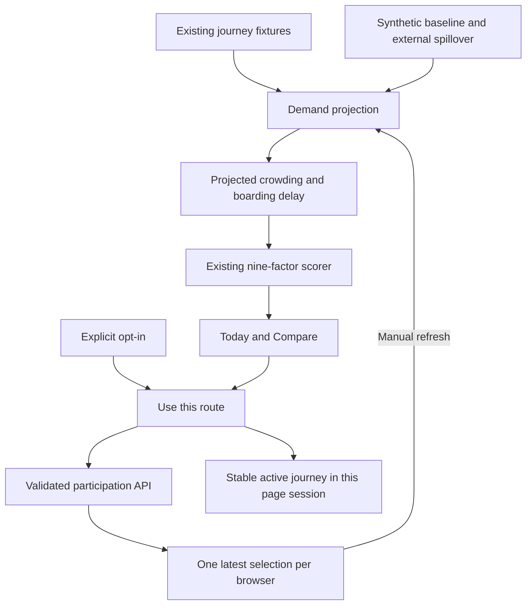

# Demand-aware rerouting: implementation and Codex handoff

Status: implemented as a synthetic, single-server demonstration. Real transport data ingestion and a production telemetry service are future work.

## Purpose

Help Rachel avoid an alternative that becomes crowded because many commuters receive the same recommendation. Combine a baseline demand estimate with the expected movement of commuters who accept alternative routes, then use the result in the existing journey scorer.

The app measures **intent to take a demo route**, not actual boarding. It does not observe SimplyGo transactions, GPS, or real commuter movements. Forecast inputs, train capacity and additional delays in this version are synthetic assumptions. They must stay visibly labelled in a pitch, screenshot and running app.

## Why this fits this project and the supplied brief

The project README already calls for persona-specific crowding penalties, deterministic fixtures, earlier-departure candidates, privacy-conscious storage and a measurable extension beyond the core brief. This feature uses those existing boundaries.

The repository's `Problem_Statement_2_Specification.pdf` states:

- Section 2.5 permits other lawfully obtained data with source attribution, and requires permission to use personal data and disclosure of storage and retention.
- Sections 3.2.1 and 3.2.3 expect conditions to influence routes and crowding to be understandable on a phone.
- Sections 3.3.1 and 3.3.2 permit explainable, measurable extensions; a complicated AI model is not required.
- Sections 2.6 and 3.2.4 require honest replay labelling and verifiable claims.

This is a compatibility assessment against the supplied documents, not separate organiser approval or a claim that the whole app meets every submission requirement. The original mandatory live-routing, DataMall, weather and real-device gaps remain. The disruption replay allowance does not establish that an entirely simulated transport product satisfies all mandatory capabilities.

## Design decision

Use an explainable demand adjustment before route scoring. Keep Rachel's deadline weights and Today / Compare / Journey navigation. Add a compact replay panel and expandable forecast explanation to route cards.

Alternatives considered:

| Approach | Decision |
| --- | --- |
| Add only a crowding chart | Insufficient: it would not change commuter advice. |
| Demand-adjusted route scoring with consent-based demo selections | Implemented: testable without credentials, payments or an existing user base. |
| Train a city-wide prediction model or automatically allocate train capacity | Deferred: needs representative observations, capacity calibration, infrastructure and evaluation. |

The accepted journey stays fixed during refresh. A new estimate may change the Today recommendation, but the user must explicitly select another route. There is no automatic route switching, push notification or continuous animation. Existing transitions respect reduced motion. New controls use semantic labels, native checkboxes/selects, keyboard focus and status announcements.

## Implemented architecture



| File | Responsibility |
| --- | --- |
| `lib/demand-flow.ts` | Pure demand projection, replay assumptions, five-minute boarding windows and a separate Bus 31 + TEL relief candidate. |
| `lib/application/demand-store.ts` | Bounded in-memory consent and selection store with expiry and replacement semantics. |
| `lib/application/demand-http.ts` | Consent/acceptance/withdrawal validation, cookie handling and same-origin checks. |
| `app/api/demand/participation/route.ts` | Node runtime HTTP entry point. |
| `lib/application/journey-orchestrator.ts` | Projects demand before scoring and passes the actual selected candidate to the map/recommendation. |
| `lib/journey-scoring.ts` | Accepts multiple candidates and chooses exactly one winner, including rounded-score ties. |
| `components/demand-panel.tsx` | Replay controls, uncertainty copy and optional participation. |
| `components/commute-app.tsx` | Forecast detail, route acceptance and stable active selection. |
| `public/sw.js` | Excludes APIs from runtime caching and HTML fallback. |

## Forecast contract and accounting

The implemented unit is **rail-corridor boarding demand for a five-minute entry window**, with direction determined by the leg's from/to stations. It is not train occupancy, platform density or a model of every physical track segment. The demo contains one rail leg per route. Do not generalise this implementation to multi-leg routes without segment/time allocation and tests.

For each candidate:

```text
projected passengers = baseline + external spillover + net app shift
net app shift = 0.8 × (accepted arrivals to this corridor/window
                       - accepted departures from this corridor/window)
```

The cohort is assumed to be included in the EWL baseline. A user switching to an alternative is subtracted from EWL and added to the relevant route corridor/window. A user accepting the original route contributes zero net change. Retries do not add passengers; a changed selection replaces the previous one. Never add all app users to a total-population historical baseline a second time.

External spillover represents a separate synthetic cohort of non-app commuters. It is not extrapolated from the app sample. No multiplication by an assumed market share occurs.

Current synthetic parameters:

| Input | Value |
| --- | --- |
| Replay decision time | 18 September 2026, 07:30 Singapore time |
| EWL baseline / assumed disrupted capacity | 600 / 700 per window |
| EWL assumed normal capacity | 1,000 per window |
| DTL 07:35 departure: baseline / external spillover / capacity | 160 / 40 / 400 |
| Bus 31 + TEL: baseline / external spillover / capacity | 110 / 25 / 400 |
| Surge seed | 400 synthetic commuters accept the regular DTL route |
| Assumed follow-through | 80% (unvalidated) |
| Server demo participation limit | 250 concurrent browser sessions |
| Low / moderate / high projected demand | Below 50% / 50–84.99% / at least 85% of assumed capacity |

The store and pure function cap the accepted cohort so the demonstration cannot subtract more commuters than its synthetic EWL population. This is a fixture constraint, not a generally valid demand cap.

An existing high crowding warning is a floor for the displayed forecast and route score, even if demand falls below the ratio threshold. Lower demand does not imply that the disrupted service has recovered.

For each non-EWL alternative, illustrative added boarding delay is:

```text
min(15, ceil(max(0, projectedPassengers / assumedCapacity - 0.85) * 12)) minutes
```

Add this to the median ETA and twice this amount to the upper ETA bound; keep the earliest bound unchanged. Existing EWL disruption delay is not applied twice. Existing high crowding is never erased because projected demand decreases. The capacity and delay formula are not calibrated; do not describe the interval as a statistical confidence interval.

Typical replay gives DTL demand of 200 and recommends the direct DTL route at 07:35. Surge replay gives that route 520 projected passengers, an illustrative six-minute delay and an 08:48 median arrival. It then adds a separate Bus 31 + Thomson-East Coast Line candidate with 135 projected TEL boardings and an 08:40 median arrival.

The relief option is a distinct physical corridor, not merely another DTL departure. Its route geometry and timings remain synthetic fixtures, so this demo does not promise reserved capacity or a system-wide optimum.

## HTTP contract

All demand responses use `Cache-Control: no-store, private`. Personal participation and forecasts must not enter the service-worker API cache.

### `GET /api/demand/participation`

Returns `{ "data": { "participating": false } }` or `true` for the caller's unexpired cookie. It creates no session and exposes no other users or selections.

### `POST /api/demand/participation`

Opt in with:

```json
{ "action": "consent", "consent": true }
```

The server issues a random HttpOnly, SameSite=Strict cookie. HTTPS requests receive Secure cookies. No cookie is issued merely by opening or comparing routes.

After opting in, accept a fixture route:

```json
{
  "action": "accept",
  "scenarioId": "ewl-disruption",
  "profile": "typical",
  "journeyId": "recommended-dtl-route"
}
```

Only known scenario/profile/route IDs and exact allowed fields are accepted. No names, addresses, coordinates, arbitrary route geometry or client-provided passenger counts are accepted. Request bodies are checked against a 1KB limit. Browser writes require a matching Origin. Missing/expired consent returns 403; invalid payloads return 400; a full store returns 503. Profile `unavailable` does not accept selections.

### `DELETE /api/demand/participation`

Deletes the caller's stored selection and expires the cookie. Other sessions remain untouched. A failed deletion displays an error; the UI does not falsely report successful withdrawal. Retry after reconnecting if offline.

### Journey endpoints

`POST /api/journeys/plan` accepts optional `demandProfile`: `typical`, `surge` or `unavailable`. It reads aggregate selections from the server; clients cannot submit cohort counts. Omit the field for the original journey flow.

The evaluate POST accepts the same optional field. The compare GET accepts `?scenario=ewl-disruption&demandProfile=surge`. Use matching profiles when requesting the separate relief-route candidate.

The forecast is recomputed only on request. The replay clock remains fixed and the UI says so. Profiles isolate selections: a typical-day acceptance does not silently count in the surge experiment. A new acceptance in another profile replaces that browser's prior selection.

## User states

| State | Required behavior |
| --- | --- |
| Initial / no consent | Forecast visible; personal sharing off; routing works. |
| Opted in | Only future explicit route selections are sent. |
| Acceptance succeeds | Confirm sharing; keep chosen journey; user may refresh forecast. |
| Acceptance fails | Keep navigation usable and state that sharing failed. |
| Refreshing | Disable replay/consent controls; announce completion or failure. |
| Surge | Separate-corridor advice, three route cards, synthetic provenance. |
| Forecast unavailable | Original estimates; no invented zero demand and no new sharing. |
| Offline | Disable demand writes/refresh, label displayed projection as stale screen data. |
| Withdrawal | Delete the contribution and cookie; confirm only after success. |
| Expired session | API rejects new acceptance until opt-in is renewed. |

Forecast detail includes corridor, Singapore-time window, source assumptions, component arithmetic, assumed capacity and added delay. The commuter's recommendation stays above these details.

## Data handling and limitations

New server state contains a random session identifier, expiry timestamp and one latest demo scenario/profile/route selection. Home/work coordinates and personal travel history are not copied into the demand store. The session is pseudonymous, not anonymous. Existing application fixtures still contain Rachel's fictional locations.

Participation expires 30 minutes after session creation. Repeated acceptance does not extend it. Expired records stop contributing; physical removal happens on the next store access or process restart. Explicit withdrawal removes the record immediately. There is no new database, export, raw-event log, GPS permission or analytics service. Hosting/network access logs are outside this implementation and need review before any real-user rollout.

The selected journey is frozen during the current page session. The pre-existing offline mechanism still saves a route ID and caches the shell; full journey restoration across reloads, IndexedDB persistence and stale-data reconciliation remain unfinished project work. Do not promise reliable offline recovery from this extension.

This store works only in one long-running Node process. A restart loses contributions and invalidates consent. Multiple workers, serverless instances or separate regions will have inconsistent state. The store cap limits memory, but is not anti-bot protection: this must not be used for real commuter telemetry or public load balancing as-is.

## Run and demonstrate

Development:

```bash
npm ci
npm run dev
```

Demand replay is enabled by default in development. To turn it off, set `DEMAND_DEMO_ENABLED=false` in `.env.local`.

For a single-process production-build demonstration:

```bash
npm run build
DEMAND_DEMO_ENABLED=true npm run start
```

The feature is disabled in production unless explicitly enabled. Keep the demo label on when enabling it. No API keys or paid services are required for this feature.

Demo sequence:

1. Open Today: direct DTL alternative, leave 07:35.
2. Select the DTL surge replay: recommendation changes to Bus 31 + Thomson-East Coast Line.
3. Open Compare: inspect the direct DTL forecast of 520 passengers and the separate TEL corridor estimate of 135.
4. Opt in under “Help test the feedback loop” and choose a route.
5. Refresh: selected journey stays fixed; estimates include the new intention.
6. Repeat from a second browser/incognito session on the same server. Each cookie contributes at most once.
7. Withdraw: the contribution disappears from subsequent forecasts.
8. Select Forecast unavailable, then disconnect: original estimates remain accessible and demand controls show their limits.

## Tests and acceptance criteria

Run `npm test`, `npm run lint`, and `npm run build`.

Automated tests cover demand conservation, source immutability, separate route corridors, cohort bounds, original normal-day behavior, surge recommendations, exact-one winner, provider-unavailable fallback, consent enforcement, duplicate/replaced selection, withdrawal, expiry, bounded storage, same-origin validation and rejection of arbitrary personal fields.

Browser checks should cover two isolated cookies sharing a server, repeated acceptance, withdrawal, stable active journey, all replay profiles, offline controls, and horizontal overflow at 320/360/390px and desktop width. Real iOS/Android devices and screen-reader checks are still required for submission readiness.

Do not publish an accuracy percentage from these tests: they verify implementation behavior, not forecast accuracy.

### Verification performed on 18 September 2026

- All 31 automated tests passed; ESLint and the Next.js production build passed.
- Headless Chrome exercised opt-in, two independent participating sessions, retry deduplication, a new visitor receiving the shared forecast, withdrawal, stable active-route selection, surge rerouting, unavailable forecasts, offline controls and the normal-day transition. No browser runtime errors occurred.
- No horizontal overflow at 320, 360, 390 or 1280 pixels. Phone-width and desktop screenshots were inspected; route titles precede model detail and high service-disruption crowd warnings remain visible after demand moves away.
- `git diff --check` passed. Public deployment, actual phone browsers, screen readers, prediction calibration and full offline reload recovery were not verified by these checks.

## Path to a live implementation

1. Connect the project's existing routing/DataMall/weather backlog first. Confirm valid alternatives, timestamps and permitted data use. Keep fixture adapters for tests.
2. Add a demand provider interface with immutable source/version/as-of/validity metadata. Import permitted LTA monthly OD aggregates as a historical baseline. They are not a live SimplyGo feed. If source time resolution is hourly, any five-minute redistribution is an explicitly estimated profile, not observed data.
3. Map route candidates to directed physical segments and arrival-time windows, including transfers, waiting, cancellations and missed departures. Shared segments must share demand even when route IDs differ.
4. Replace memory with shared transactional storage. Store one current intent per consented journey/session and atomically replace it. Add retention cleanup, withdrawal, robust request size limits, abuse controls and deployment-specific logging policies.
5. Estimate follow-through from properly permitted observations; distinguish displayed, accepted, started and completed states. Never interpret a click as confirmed boarding. Handle selection bias and coverage uncertainty; do not assume app users represent everyone.
6. Define whether historical baselines include the participating cohort. Use net changes or subtract estimated cohort overlap before combining sources. Do not separately add overlapping external spillover.
7. Calibrate demand-to-delay and service capacity by direction/time. Keep platform crowding, train occupancy, boarding flows and bus load separate.
8. Add bounded recommendation refresh intervals, material-change thresholds and fair near-equivalent option assignment. This demo freezes selected routes but does not implement global reservations, scheduler cooldowns or demand equilibrium.
9. Evaluate on held-out disruption replays: compare no-demand routing with demand-aware routing using deadline misses, maximum overloaded-window demand, forecast error and route-switch frequency. State sample size, assumptions and limitations.
10. Obtain deployment and real-user collection approval after reviewing privacy notice, retention, consent and data licences. This handoff does not authorise collecting third-party personal data or publishing the app.

## Prompt for a friend's Codex task

> Read README.md, AGENTS.md, docs/DEMAND_AWARE_ROUTING.md and the current implementation before editing. Preserve the fixture-based demand demo and its tests. Identify the next incomplete phase from “Path to a live implementation,” then implement the smallest verifiable increment that the available credentials/data and hackathon rules support. Keep source, consent, retention and demo/live distinctions explicit. Do not present assumptions as measured capacity or prediction accuracy. Run the relevant tests, lint and production build; report deployment limits and any missing authority or credentials. Do not deploy, collect real-user telemetry, or claim complete hackathon compliance without the required evidence and authorization.

## Sources and design evidence

- Supplied specification: `docs/Problem_Statement_2_Specification.pdf`, §§2.5–2.6, 3.2 and 3.3; expanded brief: `docs/Problem Statement.pdf`.
- Project contract: README §§8, 11–15 and 20–21.
- [LTA DataMall datasets](https://datamall.lta.gov.sg/content/datamall/en/search_datasets.html): source for future monthly aggregate baselines, not a claim that this demo has imported them.
- [PDPC data protection obligations](https://www.pdpc.gov.sg/overview-of-pdpa/the-legislation/personal-data-protection-act/data-protection-obligations): purpose, consent, protection and retention guidance. Production compliance remains a separate review.
- [W3C status messages](https://www.w3.org/WAI/WCAG22/Understanding/status-messages) and [WCAG 2.2](https://www.w3.org/TR/WCAG22/): labelled controls, focus and understandable feedback. No blanket accessibility conformance claim.

Design Arc's guidelines-only approach informed the explicit states, first-party evidence and user-control requirements. The user's later request authorised implementation; this document records an implemented proposal, not a separate benchmark-backed visual approval or production release certification.
